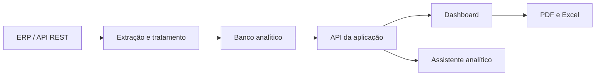

# NVT BI — Inteligência Comercial integrada a ERP


Versão pública e demonstrativa de uma plataforma de Business Intelligence criada para transformar dados operacionais de um ERP em indicadores comerciais, financeiros e gerenciais.

> **Privacidade:** pessoas, valores, metas, produtos e resultados exibidos nesta versão são fictícios. O repositório não contém credenciais, banco de produção, clientes reais ou conexão ativa com o ERP.

## Problema de negócio

Informações essenciais estavam distribuídas entre relatórios do ERP, planilhas e controles manuais. Isso aumentava o tempo necessário para conciliar faturamento, acompanhar metas, encontrar oportunidades e responder perguntas comerciais.

## Solução desenvolvida

O NVT BI centraliza os principais indicadores em uma aplicação web responsiva e organiza regras de negócio que antes dependiam de conferências manuais. A solução original utiliza integração por API, pipeline de dados, banco analítico e uma camada de visualização orientada à tomada de decisão.

## Funcionalidades demonstradas

- faturamento mensal e evolução histórica;
- vendas por família, marca e produto;
- ranking de produtos por quantidade ou valor;
- pedidos aguardando faturamento;
- clientes positivados;
- metas e comissões por consultor;
- estoque valorizado a custo e a venda;
- contas a pagar e receber;
- assistente comercial em linguagem natural;
- apresentação técnica do case e da arquitetura.

## Arquitetura da solução original



## Stack

- TypeScript
- React
- Next.js
- Recharts
- SQL e modelagem analítica
- API REST
- processos de ETL
- Cloudflare D1 e Workers na solução original
- Git e GitHub

## Executar localmente

### Requisitos

- Node.js 22 ou superior
- npm, pnpm ou yarn

### Instalação

```bash
git clone https://github.com/Italo-Farias/nvt-bi-commercial-intelligence.git
cd nvt-bi-commercial-intelligence
npm install
npm run dev
```

Acesse `http://localhost:3000`.

Nenhuma credencial é necessária: a aplicação utiliza somente dados demonstrativos presentes em `lib/demo-data.ts`.

## Decisões técnicas

1. **Separação entre produção e portfólio:** a versão pública foi criada com histórico independente e sem componentes de acesso ao ambiente real.
2. **Dados determinísticos:** os indicadores simulados permitem navegar e testar a interface sem serviços externos.
3. **Componentes orientados à análise:** os módulos priorizam leitura rápida, comparação e detalhamento progressivo.
4. **Privacidade por design:** nomes, metas, valores e produtos foram substituídos por exemplos fictícios.
5. **Responsividade:** o painel possui navegação e densidade adaptadas para desktop e dispositivos móveis.

## Estrutura

```text
app/
  globals.css       identidade visual e responsividade
  layout.tsx        metadados e estrutura global
  page.tsx          dashboard demonstrativo
lib/
  demo-data.ts      base integralmente fictícia
public/
  nvt-logo.jpg      identidade visual autorizada
docs/
  architecture.md   descrição técnica do fluxo original
```

## Limitações da demonstração

- não realiza chamadas ao Omie;
- não grava ou consulta dados externos;
- não contém autenticação real;
- exportações são apenas representadas na interface;
- respostas do assistente são locais e determinísticas.

## Autor

**Italo Farias**  
Data Analytics · Automação · Inteligência Artificial

Este projeto integra meu portfólio de transição para a área de Dados, Analytics e IA, reunindo experiência financeira, entendimento de negócio e desenvolvimento de soluções orientadas a dados.

