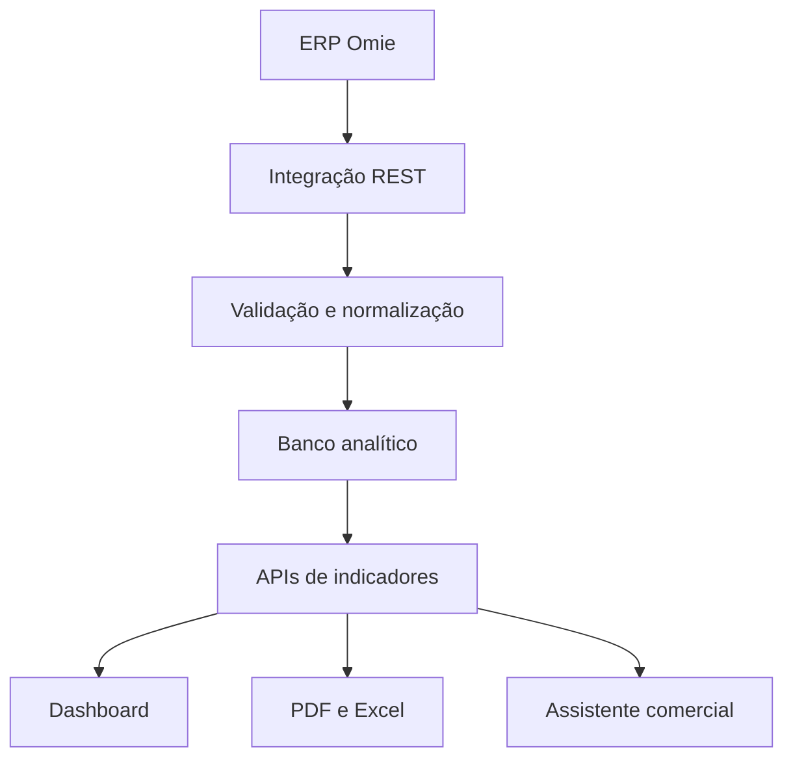

# Arquitetura técnica

## Fluxo de produção

1. O ERP disponibiliza dados operacionais por endpoints REST.
2. A camada de integração controla autenticação, paginação, tentativas e respostas de erro.
3. O processo de sincronização normaliza vendedores, clientes, produtos, marcas, famílias, pedidos, títulos e estoque.
4. Regras de conciliação tratam bonificações, devoluções, cancelamentos e diferentes etapas de faturamento.
5. O banco analítico armazena os dados estruturados para consultas de baixa latência.
6. As APIs da aplicação entregam agregações para o dashboard, relatórios e assistente comercial.

## Principais desafios tratados

- paginação e limites da API;
- sincronização incremental;
- idempotência e prevenção de duplicidade;
- datas comerciais e competência de faturamento;
- identificação de bonificações e devoluções;
- padronização de vendedores e famílias;
- regras diferentes de metas, comissões e campanhas;
- consultas analíticas rápidas em SQL;
- proteção de credenciais por variáveis de ambiente.

## Versão de portfólio

Esta versão substitui toda a camada de integração e persistência por dados locais fictícios. O objetivo é demonstrar experiência de produto, visualização, regras analíticas e comunicação técnica sem expor informações empresariais.

